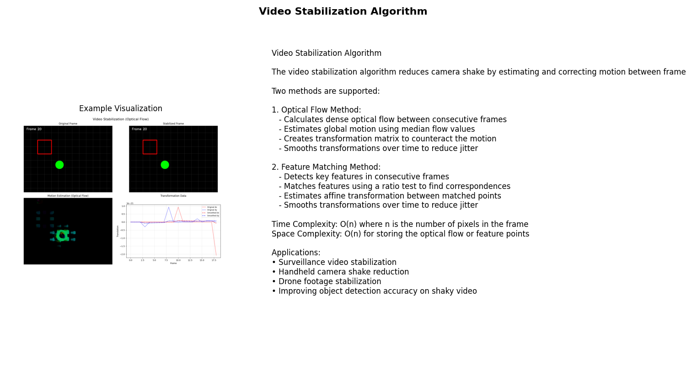
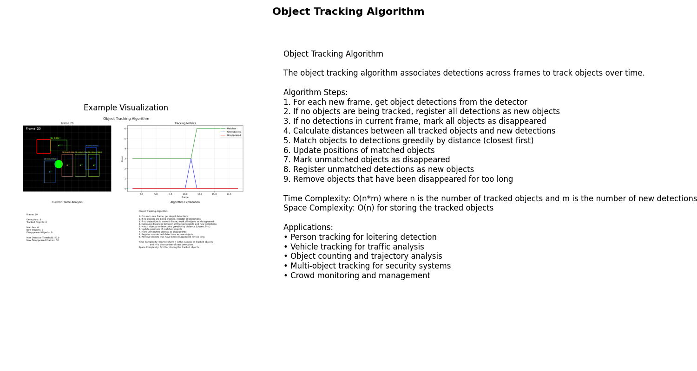
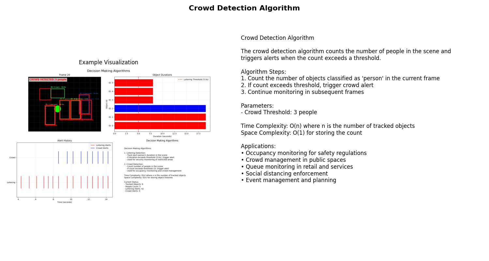

# Algorithm Visualizations

This directory contains visualizations for the algorithms used in the Vigilance System. The visualizations are designed to help understand how each algorithm works and its time complexity.

## Algorithms Included

### Preprocessing Algorithms

- **Video Stabilization**: Reduces camera shake by estimating and correcting motion between frames.
  - Methods: Optical Flow, Feature Matching
  - Time Complexity: O(n) where n is the number of pixels in the frame
  - Space Complexity: O(n) for storing the optical flow or feature points

### Tracking Algorithms

- **Centroid Tracking**: Associates detections across frames using center point distances.
  - Time Complexity: O(n*m) where n is the number of tracked objects and m is the number of new detections
  - Space Complexity: O(n) for storing the tracked objects
  - Best for: Simple scenes with limited object overlap

- **Kalman Filter Tracking**: Uses motion prediction to improve tracking accuracy.
  - Time Complexity: O(n*m) where n is the number of tracked objects and m is the number of new detections
  - Space Complexity: O(n) for storing the tracked objects and their state vectors
  - Best for: Objects with predictable motion patterns

- **IoU Tracking**: Tracks objects based on Intersection over Union of bounding boxes.
  - Time Complexity: O(n*m) where n is the number of tracked objects and m is the number of new detections
  - Space Complexity: O(n) for storing the tracked objects
  - Best for: Scenes with minimal camera movement

- **SORT Tracking**: Simple Online and Realtime Tracking algorithm.
  - Time Complexity: O(n*m) where n is the number of tracked objects and m is the number of new detections
  - Space Complexity: O(n) for storing the tracked objects and their state vectors
  - Best for: Complex scenes with multiple objects

### Classification Algorithms

- **SVM (Support Vector Machine)**: Finds the hyperplane that best separates classes.
  - Time Complexity: O(n²) to O(n³) for training, O(m*d) for prediction
  - Space Complexity: O(n) where n is the number of support vectors
  - Best for: Binary classification with clear margins

- **KNN (K-Nearest Neighbors)**: Classifies based on the k closest training examples.
  - Time Complexity: O(1) for training, O(n*d) for prediction
  - Space Complexity: O(n) where n is the number of training examples
  - Best for: Simple classification tasks with well-distributed data

- **Naive Bayes**: Probabilistic classifier based on Bayes' theorem.
  - Time Complexity: O(n*d) for training, O(d) for prediction
  - Space Complexity: O(c*d) where c is the number of classes and d is the number of features
  - Best for: Text classification and problems with independent features

### Decision Making Algorithms

- **Loitering Detection**: Tracks object duration and triggers alerts based on thresholds.
  - Time Complexity: O(n) where n is the number of tracked objects
  - Space Complexity: O(n) for storing the tracked objects and their histories

- **Crowd Detection**: Counts objects of specific classes and triggers alerts based on thresholds.
  - Time Complexity: O(n) where n is the number of tracked objects
  - Space Complexity: O(1) for storing the count

### Analysis Algorithms

- **Basic Analysis**: Simple threshold-based decision making.
  - Time Complexity: O(1)
  - Space Complexity: O(1)
  - Decision Logic: Direct comparison with thresholds

- **Weighted Analysis**: Assigns different weights to different factors.
  - Time Complexity: O(n) where n is the number of factors
  - Space Complexity: O(n) for storing weights
  - Decision Logic: Weighted sum compared to threshold

- **Fuzzy Logic Analysis**: Uses fuzzy logic for more nuanced decision making.
  - Time Complexity: O(n*r) where n is the number of factors and r is the number of rules
  - Space Complexity: O(n*r) for storing fuzzy rules
  - Decision Logic: Fuzzy inference system

## Running the Visualizations

To run all algorithm visualizations:

```bash
python -m algorithms.run_visualizations
```

This will generate sample data and create visualizations for all algorithms. The visualizations will be saved in the `visualizations` directory.

## Visualization Outputs

The visualizations include:

1. **Animated GIFs**: Showing the algorithm in action
2. **Explanation Images**: Educational diagrams explaining how each algorithm works
3. **Time Complexity Graphs**: Visual representation of the algorithm's performance characteristics

## Dependencies

- OpenCV (cv2)
- NumPy
- Matplotlib

### Network Routing Algorithms

- **Direct Routing**: Simple direct connection to the camera.
  - Time Complexity: O(1)
  - Space Complexity: O(1)
  - Latency: 10-20ms
  - Best for: Single-camera setups

- **Round Robin Routing**: Load balancing across multiple servers.
  - Time Complexity: O(1)
  - Space Complexity: O(n) where n is the number of servers
  - Latency: 15-30ms
  - Best for: Distributing load across multiple servers

- **Least Connection Routing**: Routes to the least busy server.
  - Time Complexity: O(n) where n is the number of servers
  - Space Complexity: O(n) for storing connection counts
  - Latency: 20-35ms
  - Best for: Adaptive load balancing

- **Weighted Routing**: Prioritizes high-capacity servers.
  - Time Complexity: O(n) where n is the number of servers
  - Space Complexity: O(n) for storing weights
  - Latency: 25-40ms
  - Best for: Heterogeneous server environments

- **IP Hash Routing**: Consistent routing based on IP address.
  - Time Complexity: O(1) for hash calculation
  - Space Complexity: O(n) where n is the number of servers
  - Latency: 30-45ms
  - Best for: Session persistence

## Directory Structure

```
algorithms/
├── README.md
├── visualization.py              # Common visualization utilities
├── run_visualizations.py         # Script to run all visualizations
├── preprocessing/
│   └── video_stabilization.py    # Video stabilization algorithm visualization
├── tracking/
│   ├── centroid_tracking.py      # Centroid tracking algorithm visualization
│   ├── kalman_tracking.py        # Kalman filter tracking visualization
│   ├── iou_tracking.py           # IoU tracking visualization
│   └── sort_tracking.py          # SORT tracking visualization
├── classification/
│   ├── svm_classifier.py         # SVM classifier visualization
│   ├── knn_classifier.py         # KNN classifier visualization
│   └── naive_bayes_classifier.py # Naive Bayes classifier visualization
├── analysis/
│   ├── basic_analysis.py         # Basic analysis visualization
│   ├── weighted_analysis.py      # Weighted analysis visualization
│   └── fuzzy_analysis.py         # Fuzzy logic analysis visualization
├── network/
│   ├── direct_routing.py         # Direct routing visualization
│   ├── round_robin_routing.py    # Round robin routing visualization
│   ├── least_conn_routing.py     # Least connection routing visualization
│   ├── weighted_routing.py       # Weighted routing visualization
│   └── ip_hash_routing.py        # IP hash routing visualization
└── detection/
    └── decision_making.py        # Decision making algorithms visualization
```

## Example Visualizations

### Video Stabilization

The video stabilization algorithm reduces camera shake by estimating and correcting motion between frames.



### Object Tracking

The tracking algorithms associate detections across frames to track objects over time.



### Classification

The classification algorithms categorize detected objects based on their features.


### Decision Making

The decision making algorithms include loitering detection and crowd detection.




### Analysis Algorithms

The analysis algorithms combine multiple factors to make decisions.


### Network Routing

The network routing algorithms simulate different ways to route data in a network.


